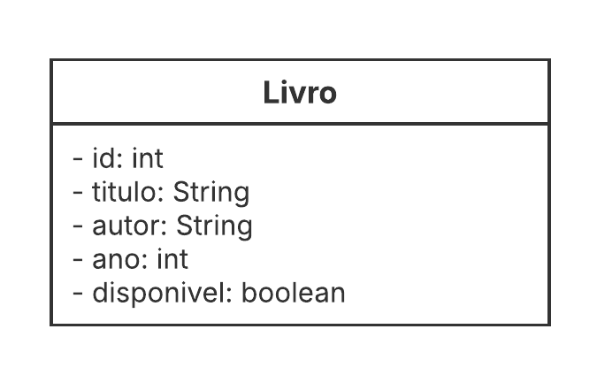
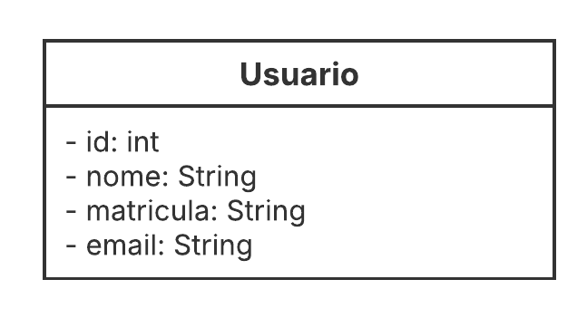
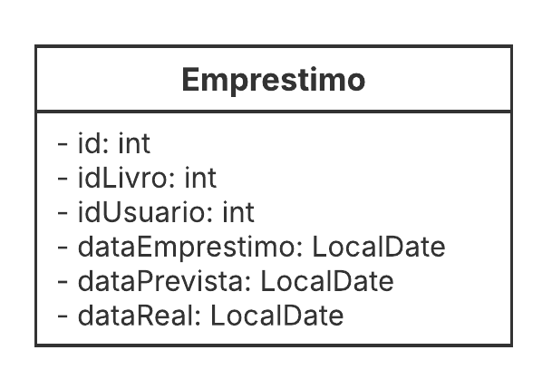

# Sistema de Gerenciamento de Biblioteca 📚
Trabalho de conclusão da disciplina de Programação Orientada a Objetos do 4º período.

## Objetivo 🎯
Criação de um sistema de gerenciamento de biblioteca para a Biblioteca Central do IFNMG, com o intuito de informatizar os processos de registro, controle e consulta de livros, usuários e empréstimos.
<br/>
## Entidades e regras de negócio
### 📙 Livro

<p align="center">
  
</p>

> 💡 A entidade Livro representa os exemplares do acervo.

**Atributos:** 
- **id** _(identificador único, tipo inteiro)_, 
- **titulo** _(texto)_, 
- **autor** _(texto)_, 
- **ano** _(inteiro)_ e 
- **disponivel** _(booleano)_.

**Regras de Negócio:** 
- Um livro pode ser emprestado somente se seu status estiver como disponivel. 
- Ao ser emprestado, o atributo disponivel deve ser atualizado para ```false```, e retorna a ```true``` quando o livro é devolvido.
<br/>

### 👤 Usuário

<p align="center">
  
</p>

> 💡 A entidade Usuário representa os indivíduos que interagem com a biblioteca.

**Atributos:** 
- **id** _(identificador único, tipo inteiro)_, 
- **nome** _(texto)_, 
- **matricula** _(texto)_ e 
- **email** _(texto)_.

**Regras de Negócio:** 
- Apenas usuários que já possuem um cadastro no sistema podem realizar empréstimos.
<br/>

### 📋 Empréstimo

<p align="center">
  
</p>
 
> 💡 A entidade Empréstimo formaliza a transação entre um usuário e um livro.

**Atributos:** 
- **id** _(identificador único, tipo inteiro)_, 
- **idLivro** _(inteiro)_, 
- **idUsuario** _(inteiro)_, 
- **dataEmprestimo** _(data)_, 
- **dataPrevista** _(data)_ e 
- **dataReal** _(data)_.

**Regras de Negócio:**
- A data de devolução prevista é determinada somando 7 dias à dataEmprestimo.
- Quando a devolução é registrada, a dataReal deve ser preenchida e o status do livro correspondente deve ser atualizado para disponível.

## Funcionalidades do sistema ⚙️
As seguintes funcionalidades serão implementadas para cada entidade:
### 💾 CRUD
- Cadastro (inserção), 
- Consulta (listagem), 
- Edição e 
- Exclusão. 

### 🗑️ Sistema de Lixeira:
Um mecanismo lógico para exclusão, oferecendo as seguintes operações:
- **Mover para a lixeira:** Mover um ou mais itens para a lixeira (por objeto, ID ou lista de IDs).
- **Listar itens:** Visualizar os itens presentes na lixeira.
- **Restaurar:** Trazer um item da lixeira de volta ao seu estado ativo.
- **Excluir definitivamente:** Remover um item da lixeira de forma permanente.
- **Esvaziar lixeira:** Excluir todos os itens da lixeira de forma permanente.


### 📝 Relatórios
O sistema disponibilizará relatórios simplificados para consulta:
- **Livros disponíveis:** Lista de todos os livros que podem ser emprestados.
- **Empréstimos ativos:** Lista de todos os empréstimos em curso.
- **Histórico de empréstimos:** Registro completo de todos os empréstimos já realizados.


## Relacionamentos 🔁
### Relacionamentos entre Entidades
- **Usuário e Empréstimo:** Um usuário pode realizar múltiplos empréstimos, mas cada empréstimo pertence a apenas um usuário. _(Relacionamento de 1 para N)_.
- **Livro e Empréstimo:** Um livro pode ser emprestado múltiplas vezes, mas cada empréstimo se refere a um único livro. _(Relacionamento de 1 para N)_.


## Considerações Finais
A implementação deste sistema possibilitará uma gestão mais eficiente, organizada e precisa do acervo e dos empréstimos da biblioteca, mitigando falhas humanas no controle de disponibilidade e na preservação de dados. A inclusão de uma lixeira lógica garante que as informações não sejam perdidas de forma definitiva por engano, permitindo sua recuperação.
