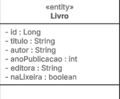
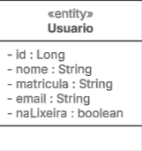

# Sistema de Gerenciamento de Biblioteca 📚
Trabalho de conclusão da disciplina de Programação Orientada a Objetos do 4º período.

## Objetivo 🎯
Criação de um sistema de gerenciamento de biblioteca para a Biblioteca Central do IFNMG, com o intuito de informatizar os processos de registro, controle e consulta de livros, usuários e empréstimos.
 
## Entidades e regras de negócio
### 📙 Livro

  

> 💡 A entidade Livro representa os exemplares do acervo.

**Atributos:** 
- **id** _(identificador único, tipo inteiro)_, 
- **titulo** _(texto)_, 
- **autor** _(texto)_, 
- **ano** _(inteiro)_ e 
- **disponivel** _(booleano)_.

### 👤 Usuário

  

> 💡 A entidade Usuário representa os indivíduos que interagem com a biblioteca.

**Atributos:** 
- **id** _(identificador único, tipo inteiro)_, 
- **nome** _(texto)_, 
- **matricula** _(texto)_ e 
- **email** _(texto)_.

### 📋 Empréstimo

  
 width="300">

 
> 💡 A entidade Empréstimo formaliza a transação entre um usuário e um livro.

**Atributos:** 
- **id** _(identificador único, tipo inteiro)_, 
- **idLivro** _(inteiro)_, 
- **idUsuario** _(inteiro)_, 
- **dataEmprestimo** _(data)_, 
- **dataPrevista** _(data)_ e 
- **dataReal** _(data)_.

## Funcionalidades do sistema ⚙️
As seguintes funcionalidades serão implementadas para cada entidade:
### 💾 CRUD
- Cadastro (inserção), 
- Consulta (listagem), 
- Edição e 
- Exclusão. 

### 🗑️ Sistema de Lixeira:
Um mecanismo lógico para exclusão, oferecendo as seguintes operações:
- **Mover para a lixeira:** Mover um ou mais itens para a lixeira (por objeto, ID ou lista de IDs).
- **Listar itens:** Visualizar os itens presentes na lixeira.
- **Restaurar:** Trazer um item da lixeira de volta ao seu estado ativo.
- **Excluir definitivamente:** Remover um item da lixeira de forma permanente.
- **Esvaziar lixeira:** Excluir todos os itens da lixeira de forma permanente.

## Considerações Finais
A implementação deste sistema possibilitará uma gestão mais eficiente, organizada e precisa do acervo e dos empréstimos da biblioteca, mitigando falhas humanas no controle de disponibilidade e na preservação de dados. A inclusão de uma lixeira lógica garante que as informações não sejam perdidas de forma definitiva por engano, permitindo sua recuperação.
